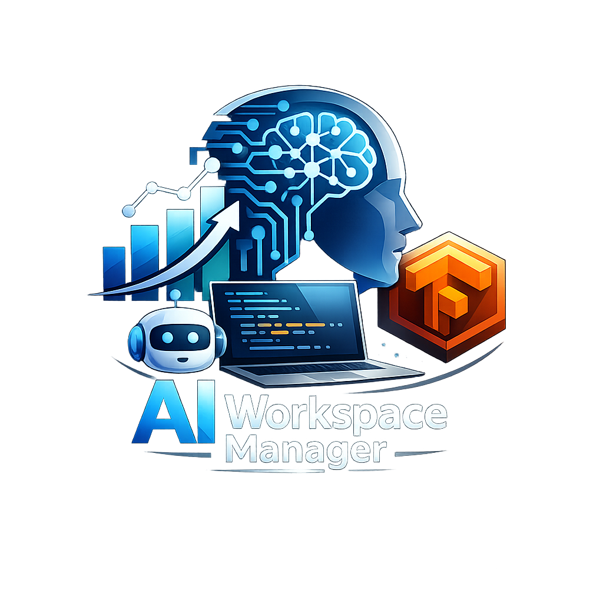

<div align="center">
  
  <h1>AI Workspace Manager</h1>

  <p>
    Centro de control local para analizar workspaces, medir salud tecnica, registrar memoria del proyecto,
    ejecutar tareas con IA y operar en Windows/macOS con Electron o en Linux/WSL con servidor web headless.
  </p>

  <p>
    <a href="LICENSE"></a>
    <a href="https://nodejs.org/">=20" src="https://img.shields.io/badge/Node.js-%3E%3D20-339933.svg?logo=node.js&logoColor=white"></a>
    <a href="https://www.electronjs.org/"></a>
    <a href="https://react.dev/"></a>
    <a href="https://www.typescriptlang.org/"></a>
    <a href="https://www.sqlite.org/"></a>
    <a href="https://www.prisma.io/"></a>
    <a href="https://github.com/wilkinbarban/AI-Workspace-Manager/releases"></a>
  </p>

  <p>
    <a href="#instalacion-rapida-en-windows">Windows</a> |
    <a href="#instalacion-rapida-en-linux-wsl-y-macos">Linux / WSL / macOS</a> |
    <a href="#comandos-disponibles">Comandos</a> |
    <a href="#arquitectura">Arquitectura</a>
  </p>
</div>

## Resumen

AI Workspace Manager es una aplicacion local para auditar, documentar y mejorar proyectos de software con ayuda de IA. Escanea carpetas del equipo, detecta tecnologias, calcula metricas de salud, genera recomendaciones, conserva memoria cronologica, registra tareas completadas y permite ejecutar agentes sobre tareas con diffs visibles.

El proyecto soporta dos modos principales:

- **Desktop Electron** para Windows y macOS.
- **Web headless** para Linux y WSL, con backend Node.js local y frontend en navegador.

La version actual del proyecto es `0.1.0` y la licencia es MIT.

## Funcionalidades

- Escaneo local de workspaces con exclusion de carpetas pesadas como `node_modules`, `.git`, `dist`, `build`, `.cache` y entornos virtuales.
- Deteccion de lenguaje principal, framework, dependencias, README, licencia, Git, Docker y tests.
- Health score por documentacion, tests, seguridad, Git, Docker, arquitectura y mantenibilidad.
- Memoria del proyecto con scans, analisis IA y tareas completadas.
- Tareas manuales o generadas por IA, con registro de avance.
- Proveedores IA configurables: OpenAI, Anthropic, DeepSeek, Google Gemini y OpenRouter.
- Consumo estimado de tokens y costos por proveedor, modelo y tipo de tarea.
- Agente con herramientas internas para listar, leer y escribir archivos dentro del workspace.
- Monitor de eventos del agente y visor de diffs para auditar cambios.
- SQLite local gestionado por Prisma.

## Requisitos

- Node.js `>= 20`.
- npm `>= 10`.
- Acceso a internet para descargar el ZIP del repositorio y dependencias npm.
- Windows: PowerShell; opcionalmente `winget` para instalar Node.js automaticamente.
- Linux/WSL: `curl` y `unzip` o `python3`.
- macOS: Homebrew recomendado si falta Node.js.
- Opcional: `keytar` para guardar API keys en el almacen seguro del sistema. Si no esta disponible, se puede usar `.env`.

## Modos de ejecucion

### Windows

Windows usa la aplicacion Electron de escritorio. El instalador `install.ps1` descarga el proyecto desde `main`, prepara la carpeta local, instala dependencias, repara Electron si hace falta, configura Prisma/SQLite y ejecuta `npm run dev`.

### Linux y WSL

Linux y WSL usan el modo web headless como ruta oficial. No se intenta arrancar Electron. El instalador Bash levanta:

- backend Node.js en `http://localhost:3000`;
- frontend Vite en `http://localhost:5173`;
- WebSocket API local en `/ws`.

El boton de anadir proyecto solicita una ruta absoluta, por ejemplo:

```text
/home/usuario/workspace/mi-proyecto
```

### macOS

macOS usa Electron Desktop en modo desarrollo. `install.sh` detecta `Darwin`, valida Node/npm, instala dependencias, repara Electron, prepara Prisma/SQLite y arranca `npm run dev`.

> Nota: el proyecto aun no genera instaladores `.app` o `.dmg`; el soporte macOS actual es para ejecucion de desarrollo con Electron.

## Instalacion rapida en Windows

Ejecuta en PowerShell:

```powershell
powershell -NoProfile -ExecutionPolicy Bypass -Command "irm https://raw.githubusercontent.com/wilkinbarban/AI-Workspace-Manager/main/install.ps1 | iex"
```

Flujo real de `install.ps1`:

- crea `install.log` temporal y luego lo mueve a la carpeta instalada;
- valida Node.js `>= 20`;
- valida npm `>= 10`;
- instala Node.js con `winget` si falta y `winget` esta disponible;
- descarga `main.zip` desde GitHub;
- evita instalar en Escritorio sincronizado con OneDrive;
- usa `%USERPROFILE%\AI-Workspace-Manager` si detecta OneDrive;
- crea backup con timestamp si ya existe una instalacion previa;
- copia `.env.example` a `.env` cuando no existe;
- instala dependencias con `npm ci` si hay `package-lock.json`, o `npm install` como fallback;
- valida `node_modules/electron/path.txt`, `dist/version` y el ejecutable de Electron;
- ejecuta `npm run electron:repair` y fallback manual si Electron esta incompleto;
- ejecuta `npm run prisma:generate`;
- ejecuta `npm run db:push`;
- inicia la aplicacion con `npm run dev`;
- guarda stdout/stderr de comandos externos en `install.log`.

Ruta de log:

```text
<carpeta-del-proyecto>\install.log
```

## Instalacion rapida en Linux, WSL y macOS

Ejecuta en una terminal:

```bash
curl -fsSL https://raw.githubusercontent.com/wilkinbarban/AI-Workspace-Manager/main/install.sh | bash
```

Flujo real de `install.sh`:

- detecta `Linux` o `Darwin`;
- identifica distribucion Linux desde `/etc/os-release`;
- valida Node.js `>= 20` y npm `>= 10`;
- en Linux instala Node.js con `apt`, `dnf`, `pacman` o `zypper` cuando aplica;
- en macOS usa Homebrew si necesita instalar Node.js;
- descarga el ZIP de `main` desde GitHub;
- extrae con `unzip` o fallback Python;
- crea backup con timestamp si la carpeta destino ya existe;
- copia `.env.example` a `.env`;
- instala dependencias con `npm ci` o `npm install`;
- en Linux/WSL exporta `ELECTRON_SKIP_BINARY_DOWNLOAD=1`, `AIWM_SKIP_ELECTRON_REPAIR=1` y `AIWM_HEADLESS_WEB=1`;
- en Linux/WSL no repara Electron y arranca backend + frontend web;
- en macOS repara Electron y ejecuta `npm run dev`;
- ejecuta `npm run prisma:generate`;
- ejecuta `npm run db:push`;
- mueve el log final a `<carpeta-del-proyecto>/install.log`.

En Linux/WSL, abre:

```text
http://localhost:5173
```

Logs generados:

- `install.log`: instalacion y preparacion.
- `server.log`: backend Node.js.
- `web.log`: frontend Vite.

Variables utiles:

```bash
TARGET_FOLDER="$HOME/AI-Workspace-Manager" curl -fsSL https://raw.githubusercontent.com/wilkinbarban/AI-Workspace-Manager/main/install.sh | bash
START_APP=false curl -fsSL https://raw.githubusercontent.com/wilkinbarban/AI-Workspace-Manager/main/install.sh | bash
BACKEND_PORT=3000 FRONTEND_PORT=5173 curl -fsSL https://raw.githubusercontent.com/wilkinbarban/AI-Workspace-Manager/main/install.sh | bash
```

## Instalacion manual en Windows/macOS

```powershell
npm install
Copy-Item .env.example .env
npm run electron:repair
npm run prisma:generate
npm run db:push
npm run dev
```

En macOS, usa `cp` en lugar de `Copy-Item`:

```bash
npm install
cp .env.example .env
npm run electron:repair
npm run prisma:generate
npm run db:push
npm run dev
```

## Ejecucion manual en Linux/WSL

Opcion recomendada en una sola terminal:

```bash
ELECTRON_SKIP_BINARY_DOWNLOAD=1 AIWM_SKIP_ELECTRON_REPAIR=1 AIWM_HEADLESS_WEB=1 npm install
cp .env.example .env
npm run prisma:generate
npm run db:push
npm run web:dev:all
```

Luego abre:

```text
http://localhost:5173
```

Opcion alternativa en dos terminales:

Terminal 1, backend:

```bash
ELECTRON_SKIP_BINARY_DOWNLOAD=1 AIWM_SKIP_ELECTRON_REPAIR=1 AIWM_HEADLESS_WEB=1 npm install
cp .env.example .env
npm run prisma:generate
npm run db:push
npm run web:server
```

Terminal 2, frontend:

```bash
npm run web:dev -- --host 0.0.0.0 --port 5173
```

Luego abre:

```text
http://localhost:5173
```

No abras `http://localhost:3000` esperando ver la interfaz durante desarrollo. Ese puerto es el backend API/WebSocket. Solo sirve la UI directamente si antes ejecutaste `npm run web:build` y luego `npm run web:start`.

## Configuracion de IA

La primera vez que abras la aplicacion, configura al menos un proveedor IA desde la pantalla inicial o desde ajustes.

Datos habituales:

- nombre visible del proveedor;
- tipo de proveedor;
- Base URL;
- modelo;
- API key;
- limite mensual opcional de tokens.

Tambien puedes usar variables de entorno en `.env`:

```env
DEEPSEEK_API_KEY=""
OPENAI_API_KEY=""
ANTHROPIC_API_KEY=""
GEMINI_API_KEY=""
OPENROUTER_API_KEY=""
```

Base SQLite local:

```env
DATABASE_URL="file:../../../.data/ai-workspace-manager.db"
```

## Comandos disponibles

| Comando | Uso |
| --- | --- |
| `npm run dev` | Inicia Electron en modo desarrollo para Windows/macOS. |
| `npm run web:dev` | Inicia el frontend web con Vite en el puerto 5173. |
| `npm run web:dev:all` | Inicia backend y frontend juntos para Linux/WSL en modo desarrollo. |
| `npm run web:server` | Inicia el backend Node.js con `tsx` en el puerto 3000. |
| `npm run web:build` | Compila frontend web y servidor backend. |
| `npm run web:build:server` | Compila solo el servidor backend hacia `out/server/index.js`. |
| `npm run web:start` | Inicia el servidor compilado y sirve la UI desde `out/web`. |
| `npm run build` | Ejecuta typecheck y compila la app Electron. |
| `npm run preview` | Previsualiza el build de Electron. |
| `npm run typecheck` | Verifica tipos TypeScript sin emitir archivos. |
| `npm run lint` | Ejecuta ESLint con cero warnings permitidos. |
| `npm test` | Ejecuta pruebas con Vitest. |
| `npm run prisma:generate` | Genera el cliente Prisma. |
| `npm run prisma:migrate` | Crea y aplica migraciones Prisma en desarrollo. |
| `npm run prisma:studio` | Abre Prisma Studio. |
| `npm run db:push` | Aplica el schema Prisma directamente a SQLite. |
| `npm run electron:install` | Ejecuta el instalador oficial del paquete Electron. |
| `npm run electron:repair` | Verifica y repara una instalacion incompleta de Electron. |

## Arquitectura

```text
src/
  main/       Electron main, preload, IPC y servicios de aplicacion.
  server/     Servidor Node.js headless con HTTP y WebSocket para Linux/WSL.
  renderer/   Interfaz React, hooks y cliente API por IPC o WebSocket.
  core/       Scanner, agentes, skills, proveedores IA y logica de dominio.
  database/   Prisma, schema SQLite, migraciones y mappers.
  shared/     Tipos, esquemas Zod, constantes IPC y errores compartidos.
tests/        Pruebas unitarias con Vitest.
```

Comunicacion:

- Electron: `renderer -> preload -> IPC -> services`.
- Web headless: `renderer -> WebSocket /ws -> src/server -> services`.

## Datos locales y seguridad

- Los proyectos, scans, tareas, memoria, reportes y consumo IA se almacenan en SQLite.
- Las API keys guardadas desde la UI usan `keytar` cuando esta disponible.
- `.env` es local y no debe subirse al repositorio.
- El scanner no sigue symlinks y excluye carpetas generadas o pesadas.
- Las skills del agente validan rutas para no escribir fuera del workspace activo.
- El servidor web escucha en `127.0.0.1` por defecto y acepta origenes locales.

## Troubleshooting

### PowerShell no permite ejecutar el instalador

Usa el comando recomendado con `-ExecutionPolicy Bypass`:

```powershell
powershell -NoProfile -ExecutionPolicy Bypass -Command "irm https://raw.githubusercontent.com/wilkinbarban/AI-Workspace-Manager/main/install.ps1 | iex"
```

### `winget` no existe

Instala Node.js manualmente desde `https://nodejs.org`, abre una nueva terminal y vuelve a ejecutar el instalador.

### Linux/WSL no abre el navegador

Abre manualmente:

```text
http://localhost:5173
```

Revisa `server.log` y `web.log` dentro de la carpeta instalada.

### Error con Electron en Windows/macOS

Si aparece `Electron uninstall`, ejecuta:

```powershell
npm run electron:repair
npm run dev
```

En Linux/WSL este flujo no aplica porque el modo oficial es web headless.

### No se guardan API keys

Si `keytar` no esta disponible en tu sistema, configura las claves en `.env` con las variables del proveedor correspondiente.

## Estado del soporte por plataforma

| Plataforma | Modo oficial | Estado |
| --- | --- | --- |
| Windows | Electron Desktop con `install.ps1` | Soportado |
| Linux | Web headless con `install.sh` | Soportado |
| WSL | Web headless con `install.sh` | Soportado |
| macOS | Electron Desktop con `install.sh` | Soportado en desarrollo |

## Licencia

Este proyecto se distribuye bajo licencia MIT. Consulta [LICENSE](LICENSE).
